```mermaid
graph TB
    subgraph ui [UI Layer - Flet Views]
        MainView[MainView]
        SystraceView[SystracePanel]
        PerfettoView[PerfettoPanel]
        SimpleperfView[SimpleperfPanel]
        TraceviewView[TraceviewPanel]
        ComboView[ComboPanel]
        SettingsView[SettingsPanel]
        AboutView[AboutPanel]
    end
    
    subgraph presenter [Presenter Layer]
        SystracePresenter[SystracePresenter]
        PerfettoPresenter[PerfettoPresenter]
        SimpleperfPresenter[SimpleperfPresenter]
        TraceviewPresenter[TraceviewPresenter]
        ComboPresenter[ComboPresenter]
    end
    
    subgraph service [Service Layer]
        CaptureService[CaptureService]
        DeviceService[DeviceService]
        ConfigService[ConfigService]
    end
    
    subgraph infra [Infrastructure Layer]
        AdbAdapter[AdbAdapter]
        SystraceAdapter[SystraceAdapter]
        SimpleperfAdapter[SimpleperfAdapter]
        PerfettoAdapter[PerfettoAdapter]
    end
    
    subgraph lib [External Tools - lib/]
        systrace_lib[systrace/]
        simpleperf_lib[simpleperf/]
        perfetto_lib[perfetto/]
    end
    
    ui --> presenter
    presenter --> service
    service --> infra
    infra --> lib
```

# EasyTracer GUI 重构计划

## 架构设计

采用 **分层架构 + MVP 模式**，确保 UI 与业务逻辑完全分离：



## 项目结构

```javascript
EasyTracer/
├── src/
│   └── easytracer/
│       ├── __init__.py
│       ├── main.py                 # 应用入口
│       ├── app.py                  # Flet App 配置
│       │
│       ├── ui/                     # UI 层 (Flet Views)
│       │   ├── __init__.py
│       │   ├── main_view.py        # 主窗口布局 (侧边栏+内容区)
│       │   ├── components/         # 可复用组件
│       │   │   ├── device_selector.py
│       │   │   ├── capture_button.py
│       │   │   └── log_panel.py
│       │   └── panels/             # 功能面板
│       │       ├── systrace_panel.py
│       │       ├── perfetto_panel.py
│       │       ├── simpleperf_panel.py
│       │       ├── traceview_panel.py
│       │       ├── combo_panel.py      # 组合抓取面板
│       │       ├── settings_panel.py
│       │       └── about_panel.py      # 关于页面
│       │
│       ├── presenters/             # Presenter 层
│       │   ├── __init__.py
│       │   ├── base_presenter.py
│       │   ├── systrace_presenter.py
│       │   ├── perfetto_presenter.py
│       │   ├── simpleperf_presenter.py
│       │   ├── traceview_presenter.py
│       │   └── combo_presenter.py      # 组合抓取 Presenter
│       │
│       ├── services/               # Service 层 (业务逻辑)
│       │   ├── __init__.py
│       │   ├── device_service.py   # 设备管理
│       │   ├── capture_service.py  # 抓取服务
│       │   └── config_service.py   # 配置管理
│       │
│       ├── infrastructure/         # 基础设施层
│       │   ├── __init__.py
│       │   ├── adb_adapter.py      # ADB 命令封装
│       │   ├── systrace_adapter.py # Systrace 调用
│       │   ├── simpleperf_adapter.py
│       │   └── perfetto_adapter.py
│       │
│       └── models/                 # 数据模型
│           ├── __init__.py
│           ├── device.py
│           ├── capture_config.py
│           └── capture_result.py
│
├── lib/                        # 外部工具 (隔离目录，可独立更新)
│   ├── systrace/               # Google systrace (Python 3 版本)
│   ├── simpleperf/             # Google simpleperf
│   └── perfetto/               # Perfetto 工具
│
├── config/                     # 配置文件
│   ├── default_config.json
│   └── perfetto_cfg.pbtx
│
├── output/                     # 输出目录
├── tests/                      # 测试
├── pyproject.toml              # uv 依赖管理
├── uv.lock                     # uv lock 文件
└── README.md
```

## 技术选型

| 组件 | 选型 | 说明 ||------|------|------|| GUI 框架 | **Flet 0.27+** | Material Design 3, 响应式 || Python | **3.13** | 按要求 || 依赖管理 | **uv** | 现代 Python 包管理器 || 打包工具 | **PyInstaller** | Flet 官方推荐，目录打包 || 测试 | **pytest** | TDD 驱动 || 类型检查 | **mypy** | 类型安全 || 代码规范 | **ruff** | Google Python Style |

## UI 设计

### 整体布局：侧边栏导航 + 内容面板

```javascript
┌────────────────────────────────────────────────────────────────────────┐
│  EasyTracer - Android Performance Tracer                    _ □ ✕    │
├──────────────┬─────────────────────────────────────────────────────────┤
│              │  ┌─────────────────────────────────────────────────┐   │
│  🔌 设备     │  │  Device: [ Pixel 7 Pro (ABC123)        ▼] [🔄]  │   │
│  ──────────  │  │  抓取后输出: ☑Logcat ☑Packages ☐PS ☐Meminfo     │   │
│              │  └─────────────────────────────────────────────────┘   │
│  📊 Systrace │                                                         │
│              │  ┌─ 内容面板区域 ────────────────────────────────────┐  │
│  🔥 Perfetto │  │                                                   │  │
│              │  │  (根据侧边栏选择显示不同的配置面板)                │  │
│  📈 Simpleperf│  │                                                   │  │
│              │  │                                                   │  │
│  🔬 Traceview│  │                                                   │  │
│              │  │                                                   │  │
│  ──────────  │  └───────────────────────────────────────────────────┘  │
│  🎯 组合抓取 │                                                         │
│              │  ┌─ Output Log ──────────────────────────────────────┐ │
│  ──────────  │  │ [10:30:15] Capturing systrace...                  │ │
│  ⚙️ 设置     │  │ [10:30:25] Trace saved to output/xxx.html         │ │
│  ℹ️ 关于     │  └───────────────────────────────────────────────────┘ │
└──────────────┴─────────────────────────────────────────────────────────┘
```

### 侧边栏导航项

| 导航项 | 功能说明 |

|--------|---------|

| 🔌 设备 | 设备连接状态，点击刷新设备列表 |

| 📊 Systrace | Systrace 抓取 (标准Atrace + 设备Ftrace) |

| 🔥 Perfetto | Perfetto trace 抓取 (Normal/Long，UI构建配置) |

| 📈 Simpleperf | 性能采样 + 火焰图生成 |

| 🔬 Traceview | 方法跟踪抓取 |

| 🎯 **组合抓取** | 多工具同时抓取配置 |

| ⚙️ 设置 | 全局配置、输出目录、ADB路径等 |

| ℹ️ 关于 | 工具介绍、版本、GitHub 地址 |

### 主界面顶部通用区域

抓取后附加输出选项统一放在主界面顶部，所有工具共享：

```javascript
┌─ 主界面顶部通用区域 ─────────────────────────────────────────────────────────┐
│                                                                              │
│  Device: [ Pixel 7 Pro (ABC123)          ▼] [🔄]                            │
│                                                                              │
│  抓取后附加输出:  ☑Logcat  ☑Packages  ☐PS  ☐Meminfo                         │
│                                                                              │
└──────────────────────────────────────────────────────────────────────────────┘
```

---

### Systrace 面板设计

```javascript
┌─ Systrace Configuration ─────────────────────────────────────────────────────┐
│                                                                              │
│  ┌─ 基础配置 ─────────────────────────────────────────────────────────────┐ │
│  │  Duration: [ 5s ▼]                         Buffer: [ 10240 ] KB        │ │
│  └────────────────────────────────────────────────────────────────────────┘ │
│                                                                              │
│  ┌─ 目标应用 ─────────────────────────────────────────────────────────────┐ │
│  │  Target: [ 所有应用 (*)                                            ▼] │ │
│  │          (所有应用/当前前台/Launcher/SystemUI/Settings/自定义...)      │ │
│  └────────────────────────────────────────────────────────────────────────┘ │
│                                                                              │
│  ┌─ Trace Categories ─────────────────────────────────────── 已选: 13 ────┐ │
│  │                                                                        │ │
│  │  [ 标准 Atrace ]  [ 设备 Ftrace ]                      [🔄 检测设备]  │ │
│  │  ━━━━━━━━━━━━━━━                                                      │ │
│  │                                                                        │ │
│  │  预设: [最小可用] [图形分析] [系统分析] [全选] [清除]                  │ │
│  │                                                                        │ │
│  │  ┌─────────────────────────────────────────────────────────────────┐  │ │
│  │  │ ☑sched ☑freq ☑idle ☐disk ☐sync │ ☑am ☑wm ☑view ☑gfx ☑input    │  │ │
│  │  │ ☑binder_driver ☑binder_lock    │ ☑dalvik ☐memory ☐memreclaim  │  │ │
│  │  │ ☐hal ☐ss ☐pm ☐power ☐thermal   │ ☐audio ☐video ☐camera        │  │ │
│  │  │ ☐network ☐database ☐webview    │ ☐res ☐rs ☐aidl ☐vibrator     │  │ │
│  │  └─────────────────────────────────────────────────────────────────┘  │ │
│  │                                                                        │ │
│  └────────────────────────────────────────────────────────────────────────┘ │
│                                                                              │
│  ┌─ 输出选项 ─────────────────────────────────────────────────────────────┐ │
│  │  ☐ Enhance Trace (增强线程名显示，替换 <...> 为实际名称)               │ │
│  └────────────────────────────────────────────────────────────────────────┘ │
│                                                                              │
│  ┌─ 输出路径 ─────────────────────────────────────────────────────────────┐ │
│  │  Output: [ ./output                                       ] [Browse]   │ │
│  │  ☐ 为每次抓取创建单独文件夹                                            │ │
│  └────────────────────────────────────────────────────────────────────────┘ │
│                                                                              │
│                         [ ▶ Start Capture ]                                  │
└──────────────────────────────────────────────────────────────────────────────┘
```

**Systrace 设备 Ftrace Tab** (切换后显示)：

- 点击 [🔄 检测设备] 从设备读取可用 ftrace events
- 支持搜索过滤 (如 `gpu`, `kgsl`, `mdss`)
- 按子系统分组 (GPU/Display/Power...)

**Systrace 配置参数：**| 配置项 | 类型 | 默认值 | 说明 ||--------|------|--------|------|| Duration | dropdown | 5s | 可选 5s/7s/10s/30s/自定义 || Buffer Size | int | 10240 KB | 建议 Duration × 2048 || Target | dropdown | 所有应用(*) | 目标应用选择 || Atrace Categories | multi-select | 最小可用(11个) | 标准 atrace 类别 || Device Ftrace | multi-select | - | 设备特有 ftrace 节点 || Enhance Trace | bool | false | 增强线程名显示 || Output Path | path | ./output | 输出目录 || Create Subfolder | bool | false | 为每次抓取创建单独文件夹 |**Systrace 预设配置：**| 预设 | Categories | 数量 ||------|------------|------|| 最小可用 | sched, freq, idle, am, wm, view, gfx, input, dalvik, binder_driver, binder_lock | 11 || 图形分析 | 最小可用 + webview, res, rs | 14 || 系统分析 | 最小可用 + hal, ss, pm, power, thermal, disk, sync, memory, memreclaim | 20 |---

### Perfetto 面板设计

```javascript
┌─ Perfetto Configuration ─────────────────────────────────────────────────────┐
│                                                                              │
│  ┌─ 抓取模式 ─────────────────────────────────────────────────────────────┐ │
│  │   ● Normal (内存缓冲)              ○ Long (实时写文件)                  │ │
│  │     适合短时分析 (≤60s)              适合长时监控 (分钟级)               │ │
│  └────────────────────────────────────────────────────────────────────────┘ │
│                                                                              │
│  ┌─ 基础配置 ─────────────────────────────────────────────────────────────┐ │
│  │  Duration: [ 10s ▼]                            Buffer: [ 150 ▼] MB     │ │
│  └────────────────────────────────────────────────────────────────────────┘ │
│                                                                              │
│  ┌─ Data Sources ─────────────────────────────────────────── 已启用: 6 ───┐ │
│  │                                                                        │ │
│  │  [ 核心追踪 ] [ 渲染/GPU ] [ 内存分析 ] [ 电源/性能 ] [ 日志/其他 ]    │ │
│  │  ━━━━━━━━━━━                                                           │ │
│  │                                                                        │ │
│  │  ☑ linux.ftrace                         内核 Ftrace 追踪               │ │
│  │     ┌─ Atrace Categories ────────────────────────── 已选: 20 ───────┐ │ │
│  │     │ 预设: [性能分析▼]                                             │ │ │
│  │     │ ☑gfx ☑input ☑view ☑wm ☑am ☑sched ☑freq ☑idle ☑dalvik        │ │ │
│  │     │ ☑binder_driver ☑binder_lock ☑hal ☐webview ☐network ...      │ │ │
│  │     └───────────────────────────────────────────────────────────────┘ │ │
│  │     ┌─ Ftrace Events ──────────────────────────── 已选: 12 ─────────┐ │ │
│  │     │ ☑sched/sched_switch ☑sched/sched_wakeup ☑power/cpu_frequency │ │ │
│  │     │ ☑power/cpu_idle ☑task/task_newtask ☑task/task_rename ...     │ │ │
│  │     └───────────────────────────────────────────────────────────────┘ │ │
│  │     Atrace Apps: [ 所有应用 (*)                                   ▼] │ │
│  │     Buffer: [ 24576 ]KB    Drain Period: [ 1000 ]ms                   │ │
│  │                                                                        │ │
│  │  ☑ linux.process_stats                  进程/线程状态                  │ │
│  │  ☑ linux.sys_stats                      系统统计 (CPU/内存)            │ │
│  │  ☑ linux.system_info                    系统基础信息                   │ │
│  │                                                                        │ │
│  └────────────────────────────────────────────────────────────────────────┘ │
│                                                                              │
│  ┌─ 输出路径 ─────────────────────────────────────────────────────────────┐ │
│  │  Output: [ ./output                                       ] [Browse]   │ │
│  │  ☐ 为每次抓取创建单独文件夹                                            │ │
│  └────────────────────────────────────────────────────────────────────────┘ │
│                                                                              │
│                         [ ▶ Start Capture ]                                  │
└──────────────────────────────────────────────────────────────────────────────┘
```

**Perfetto Data Sources Tab 分组：**| Tab | Data Sources | 说明 ||-----|--------------|------|| 核心追踪 | linux.ftrace, linux.process_stats, linux.sys_stats, linux.system_info | 必选基础数据 || 渲染/GPU | android.surfaceflinger.frametimeline, android.surfaceflinger.frame, android.gpu.memory, android.gpu.work | 帧渲染分析 || 内存分析 | android.heapprofd, android.java_hprof, linux.kmem_activity | 内存专项 || 电源/性能 | android.power, linux.perf | 电源性能 || 日志/其他 | android.packages_list, android.log, android.network_packets, track_event | 辅助信息 |**Perfetto 配置参数：**| 配置项 | 类型 | Normal默认 | Long默认 | 说明 ||--------|------|------------|----------|------|| Mode | enum | Normal | - | Normal/Long || Duration | dropdown | 10s | 10min | 抓取时长 || Buffer | dropdown | 150MB | 150MB | 主缓冲区 || Write Period | int | - | 2500ms | Long模式写文件周期 || Flush Period | int | - | 30000ms | Long模式刷新周期 || Data Sources | multi | 6个 | 6个 | 启用的数据源 || Output Path | path | ./output | ./output | 输出目录 || Create Subfolder | bool | false | false | 为每次抓取创建单独文件夹 |**Long 模式额外配置：**

- Write Period: 多久写一次文件 (默认 2500ms)
- Flush Period: 多久刷新一次 (默认 30000ms)
- 警告提示: 长时间抓取会持续写入设备存储

---

### 组合抓取面板设计

```javascript
┌─ 组合抓取配置 ────────────────────────────────────────────────────────────────┐
│                                                                               │
│  ┌─ 选择抓取工具 ──────────────────────────────────────────────────────────┐ │
│  │  ┌───────────────────────┐  ┌───────────────────────┐                  │ │
│  │  │ ☑ Perfetto            │  │ ☑ Simpleperf          │                  │ │
│  │  │ Mode: ●Normal ○Long   │  │ Freq: [ 1000 ▼] Hz    │                  │ │
│  │  └───────────────────────┘  └───────────────────────┘                  │ │
│  └─────────────────────────────────────────────────────────────────────────┘ │
│                                                                               │
│  ┌─ 目标应用 ──────────────────────────────────────────────────────────────┐ │
│  │  Target: [ 所有应用 (*)                                             ▼] │ │
│  │  ☑ 冷启动模式 (先 force-stop 目标应用)                                  │ │
│  └─────────────────────────────────────────────────────────────────────────┘ │
│                                                                               │
│  ┌─ 通用配置 ──────────────────────────────────────────────────────────────┐ │
│  │  Duration: [ 10s ▼]                                                     │ │
│  └─────────────────────────────────────────────────────────────────────────┘ │
│                                                                               │
│                         [ ▶ 开始组合抓取 ]                                    │
└───────────────────────────────────────────────────────────────────────────────┘
```

### 关于页面设计

```javascript
┌─ About EasyTracer ───────────────────────────────────────────────────────┐
│                                                                          │
│                        ┌─────────────────┐                               │
│                        │    EasyTracer   │                               │
│                        │      Logo       │                               │
│                        └─────────────────┘                               │
│                                                                          │
│                    EasyTracer v1.0.0                                     │
│                                                                          │
│   Android Performance Tracing Tool                                       │
│   一站式 Android 性能跟踪抓取工具                                         │
│                                                                          │
│   ─────────────────────────────────────────────────────────────────────  │
│                                                                          │
│   功能特性：                                                              │
│   • Systrace / Perfetto / Simpleperf / Traceview 一键抓取                │
│   • 支持多工具组合抓取                                                    │
│   • 自动生成火焰图                                                        │
│   • 冷启动分析支持                                                        │
│                                                                          │
│   ─────────────────────────────────────────────────────────────────────  │
│                                                                          │
│   🔗 GitHub:  https://github.com/user/EasyTracer    [Open in Browser]   │
│   📄 License: MIT                                                        │
│   👤 Author:  Your Name                                                  │
│                                                                          │
└──────────────────────────────────────────────────────────────────────────┘
```

### Simpleperf 面板设计

```javascript
┌─ Simpleperf Configuration ──────────────────────────────────────────────────┐
│                                                                              │
│  ┌─ 基础配置 ─────────────────────────────────────────────────────────────┐ │
│  │  Duration: [ 5s ▼]                         Frequency: [ 1000 ▼] Hz     │ │
│  └────────────────────────────────────────────────────────────────────────┘ │
│                                                                              │
│  ┌─ 目标进程 ─────────────────────────────────────────────────────────────┐ │
│  │  Target: [ 当前前台应用 (Top App)                                   ▼] │ │
│  │          ┌────────────────────────────────┐                            │ │
│  │          │ ● 当前前台应用 (Top App)       │                            │ │
│  │          │ ─────────────────────────────  │                            │ │
│  │          │   系统应用                     │                            │ │
│  │          │ ○ Launcher                     │                            │ │
│  │          │ ○ SystemUI                     │                            │ │
│  │          │ ○ Settings                     │                            │ │
│  │          │ ─────────────────────────────  │                            │ │
│  │          │   系统进程                     │                            │ │
│  │          │ ○ system_server                │                            │ │
│  │          │ ○ surfaceflinger               │                            │ │
│  │          │ ─────────────────────────────  │                            │ │
│  │          │ ○ 自定义包名...                │                            │ │
│  │          │ ○ 指定 PID...                  │                            │ │
│  │          └────────────────────────────────┘                            │ │
│  │  ☐ 冷启动模式 (先 force-stop 目标应用)                                 │ │
│  └────────────────────────────────────────────────────────────────────────┘ │
│                                                                              │
│  ┌─ 采样选项 ─────────────────────────────────────────────────────────────┐ │
│  │  ☑ 生成火焰图 (Flamegraph)                                             │ │
│  │  ☑ 同时采集 Off-CPU 事件 (分析阻塞时间)                                │ │
│  └────────────────────────────────────────────────────────────────────────┘ │
│                                                                              │
│  ┌─ 输出路径 ─────────────────────────────────────────────────────────────┐ │
│  │  Output: [ ./output                                       ] [Browse]   │ │
│  │  ☐ 为每次抓取创建单独文件夹                                            │ │
│  └────────────────────────────────────────────────────────────────────────┘ │
│                                                                              │
│                         [ ▶ Start Capture ]                                  │
└──────────────────────────────────────────────────────────────────────────────┘
```

**Simpleperf 配置参数：**

| 配置项 | 类型 | 默认值 | 说明 |

|--------|------|--------|------|

| Duration | dropdown | 5s | 可选 5s/10s/30s/60s/自定义 |

| Frequency | dropdown | 1000 Hz | 采样频率 500/1000/4000/10000 Hz |

| Target | dropdown | 当前前台应用 | 目标进程选择 |

| Cold Start | bool | false | 冷启动模式 |

| Generate Flamegraph | bool | true | 生成火焰图 |

| Include Off-CPU | bool | true | 采集 Off-CPU 事件 |

| Output Path | path | ./output | 输出目录 |

| Create Subfolder | bool | false | 为每次抓取创建单独文件夹 |

**Target 下拉选项：**

| 分类 | 选项 | 包名/进程名 |

|------|------|-------------|

| **前台应用** | 当前前台应用 | 自动检测 |

| **系统应用** | Launcher | `com.android.launcher3` |

| | SystemUI | `com.android.systemui` |

| | Settings | `com.android.settings` |

| **系统进程** | system_server | `system_server` |

| | surfaceflinger | `surfaceflinger` |

| **自定义** | 自定义包名 | 用户输入 |

| | 指定 PID | 用户输入 |

**输出文件：**

| 文件 | 说明 |

|------|------|

| `{device}_{pkg}_perf_{time}.data` | 原始采样数据 |

| `{device}_{pkg}_Flamegraph_Thread_{time}.html` | 按线程分组火焰图 |

---

### Traceview 面板设计 (待定)

```javascript
┌─ Traceview Configuration ────────────────────────────────────────────────────┐
│                                                                              │
│  ┌─ 基础配置 ─────────────────────────────────────────────────────────────┐ │
│  │  Duration: [ 5s ▼]                         Sampling Interval: [ 1 ▼]ms │ │
│  └────────────────────────────────────────────────────────────────────────┘ │
│                                                                              │
│  ┌─ 抓取模式 ─────────────────────────────────────────────────────────────┐ │
│  │   ● Sample Mode (采样模式)           ○ Trace All (完整跟踪)            │ │
│  │     开销低，适合长时间抓取             开销高，适合精确分析              │ │
│  └────────────────────────────────────────────────────────────────────────┘ │
│                                                                              │
│  ┌─ 目标进程 ─────────────────────────────────────────────────────────────┐ │
│  │  Target: [ 当前前台应用 (Top App)                                   ▼] │ │
│  │  ☐ 冷启动模式 (先 force-stop 目标应用)                                 │ │
│  └────────────────────────────────────────────────────────────────────────┘ │
│                                                                              │
│  ┌─ 输出路径 ─────────────────────────────────────────────────────────────┐ │
│  │  Output: [ ./output                                       ] [Browse]   │ │
│  │  ☐ 为每次抓取创建单独文件夹                                            │ │
│  └────────────────────────────────────────────────────────────────────────┘ │
│                                                                              │
│                         [ ▶ Start Capture ]                                  │
└──────────────────────────────────────────────────────────────────────────────┘
```

**Traceview 配置参数：**

| 配置项 | 类型 | 默认值 | 说明 |

|--------|------|--------|------|

| Duration | dropdown | 5s | 可选 5s/10s/30s/自定义 |

| Mode | enum | Sample | Sample/Trace All |

| Sampling Interval | dropdown | 1ms | 仅 Sample 模式有效 |

| Target | dropdown | 当前前台应用 | 目标进程选择 |

| Cold Start | bool | false | 冷启动模式 |

| Output Path | path | ./output | 输出目录 |

| Create Subfolder | bool | false | 为每次抓取创建单独文件夹 |

---

## MVP 功能范围 (Phase 1)

1. **设备连接** - 自动检测已连接的 Android 设备，支持刷新
2. **Systrace 抓取** - 标准 Atrace Categories + 设备 Ftrace 节点，预设配置
3. **Perfetto 抓取** - Normal/Long 两种模式，UI 构建配置，支持多种 Data Sources
4. **Simpleperf 抓取** - 火焰图生成 (按线程分组)
5. **Traceview 抓取** - 方法跟踪 (Sample/Trace All 模式)
6. **组合抓取** - Perfetto + Simpleperf 等多工具同时抓取
7. **实时日志** - 显示操作进度和输出
8. **配置持久化** - 保存用户配置，下次启动自动恢复
9. **通用输出选项** - Logcat/Packages/PS/Meminfo 统一配置

## 关键实现要点

### 1. UI 与逻辑分离

View 只负责展示，通过 Presenter 接口与业务交互：

```python
# ui/panels/systrace_panel.py
class SystracePanel:
    def __init__(self, presenter: SystracePresenter):
        self.presenter = presenter
    
    def on_capture_click(self, e):
        self.presenter.start_capture(
            duration=self.duration_input.value,
            buffer_size=self.buffer_input.value
        )

# presenters/systrace_presenter.py  
class SystracePresenter:
    def __init__(self, capture_service: CaptureService):
        self.capture_service = capture_service
    
    async def start_capture(self, duration: int, buffer_size: int):
        # 业务逻辑在 service 层
        await self.capture_service.capture_systrace(...)
```

### 2. 外部工具隔离

lib/ 目录作为「插件」存在，通过 Adapter 模式调用：

```python
# infrastructure/systrace_adapter.py
class SystraceAdapter:
    def __init__(self, lib_path: Path):
        self.systrace_path = lib_path / "systrace" / "systrace.py"
    
    def capture(self, serial: str, duration: int, ...) -> Path:
        # 调用外部 systrace.py
        cmd = [sys.executable, str(self.systrace_path), ...]
        subprocess.run(cmd, ...)
```

### 3. 打包配置

使用 PyInstaller **目录模式** 打包，源码编译为字节码 (隐藏 .py 源文件)：

```python
# build.spec (PyInstaller spec)
a = Analysis(
    ['src/easytracer/main.py'],       # 入口文件
    pathex=['src'],                    # 源码路径
datas=[
    ('lib/systrace', 'lib/systrace'),
    ('lib/simpleperf', 'lib/simpleperf'),
    ('config', 'config'),
    ],
    hiddenimports=['flet', ...],
    ...
)

# 关键配置
exe = EXE(
    pyz,
    a.scripts,
    [],
    exclude_binaries=True,             # 目录模式
    name='EasyTracer',
    ...
)

coll = COLLECT(
    exe,
    a.binaries,
    a.zipfiles,
    a.datas,
    strip=False,
    name='EasyTracer',
)
```

**打包输出结构：**

```
dist/EasyTracer/
├── EasyTracer.exe            # 主程序入口
├── _internal/                # PyInstaller 运行时 + 编译后的字节码 (.pyc)
│   ├── easytracer/          # 应用代码 (已编译，无 .py 源文件)
│   ├── flet/                # 依赖库
│   └── ...
├── lib/                      # 外部工具 (原样保留，可独立更新)
│   ├── systrace/
│   ├── simpleperf/
│   └── perfetto/
└── config/                   # 配置文件
```

**源码保护说明：**

- PyInstaller 默认将 `.py` 编译为 `.pyc` 字节码打包
- `src/easytracer/` 下的源码不会以明文形式出现在 dist 目录
- `lib/` 外部工具保持原样，方便用户独立更新

## 迁移策略